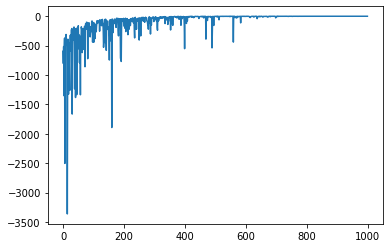

# 
SI630 Natural Language Processing Final Project 

 Text analysis of financial reports by Natural Language Processing 

> Author: Minghao Yang minghaoy@umich.edu     To see the blog post, click [here](https://minghaoy.medium.com/nlp-on-financial-reports-18805bd65fc3)

## Project Goal
The whole project is an experiment on performing NLP algorithms on financial reports, since traditionally analysts more focus on the structured data provided in the statements, and can only use their experience and knowledge to interpret what are contained in the unstructured text data in financial reports.

## Data Collection and process
The project focus on the technology sector of the stock market. I randomly choose 52 companies from this sector doing business in different areas including electrical equipment, computer peripherals, semiconductors, etc. From Factset database, I downloaded their 10-K reports, which is the annual financial report providing comprehensive overviews of a company’s business, in the recent 10 years, from 2011 to 2020. Since they are in the pdf files, with the aid of Python Tesseract, I transformed them into txt files. To sum up, there are more than 50,000 words within each document, and 420 fully transformed reports for model fitting.  I built my own corpus by the textual parts of 420 reports with the stock performance as the label, and the annotation work was completed manually.

## Data Exploration
After getting rid of all unrelated words and punctuations, I build a corpus for companies in the same industry. Then I used word clouds to visualize the data, and tried to find
the words with the largest frequencies. Moreover, since I’ve already labeled the reports, I plotted two word clouds. The first contains the words appearing in the reports that lead to a decrease stock performance, and the second is from the other class.

  
  

Furthermore, I used topic selection model LDA to further investigate the data. The main reason to use this model is to find if there are some unique topics for reports with good or bad stock performance. The following plot shows the topics for reports with bad stock performance.

  

## Fitting Models
Firstly I retrained the GPT2 to do the sentimental classification better based on a huge pre-trained corpus and fine-tuned model. I managed to divide the report into small sentence and predict if each sentence is positive or negtive. Then I determined the class of the whole report by comparing between the total numbers of the positive sentenses and the negative sentenses. The GPT2 model worked here after I transformed sentences into ”sentence +(special char) + Postive/Negative” form, and train the model to generate the following word after the special char. 

  

Then I tried Naive Bayesian model and Logistic Regression model to make simple classification. And compared between them to see they works and if the classification is effective. For naive bayesian model, the features are frequencies of each word, and in logistic regression model, I use onehot encoding method to
transform texts into vectors. And the training set and the test set are all set as 9:1 for above models.

  

# Evaluating

I calculated the F-1 scores to compare the effectiveness of different models

|     | Baseline accounting analysis | GPT-2 model | Naive Bayesian | Logistic Regression |
| --- | --- | --- | --- | --- |
| F-1 Scores of the test sets |  0.94  |  0.63  |  0.78  |  0.97  | 

As for GPT2 model, I tried to perform ”sentiment” analysis on sentences in each report. Ideally, the results can be only ”positive” or ”negative”. However, there are a great numbers of sentences return something not useful, and it may significantly reduce the accuracy of this method. From my opinion I think this comes from the length of each sentences. According to this issue, after getting rid of those results, I calculate the F-1 score of this method, which is 0.6312.

The result is not satisfying enough, and because of the drop of great numbers of sentences, the result is also not trustworthy. Therefore I then worked on directly classify the whole reports. I built a naive bayesian and a logistic regression model to predict the class of the entire document, and used F-1 score to compare between their effectiveness. With the naive Bayesian method, the F-1 score of the test set is 0.7826, while the F-1 score for the logistic regression model is 0.9655. The later one is surprisingly high, which is even higher than the result from the baseline method.

# Conclusion

In order to analyze the textual part of the financial reports, I organized my own data set with 10-K reports of 52 companies in tech industry, and transformed them into machine readable text with labels. Then I use topic model LDA and try to summarize the top salient words for each class, but the information achieved from that model looks not so valuable. Then I decide to do the classification by firstly using GPT-2 to predict the ”sentiment” response for each sentence, then use Naive Bayesian and Logistic regression model to predict from the whole document. It turns out that predicting based on the whole document is more effective and trustworthy.
